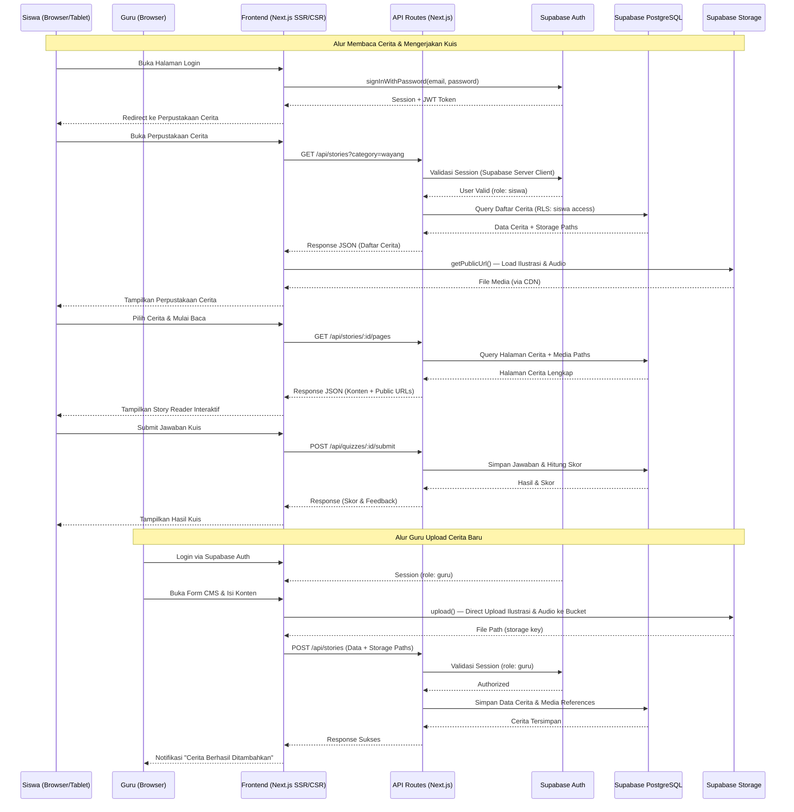
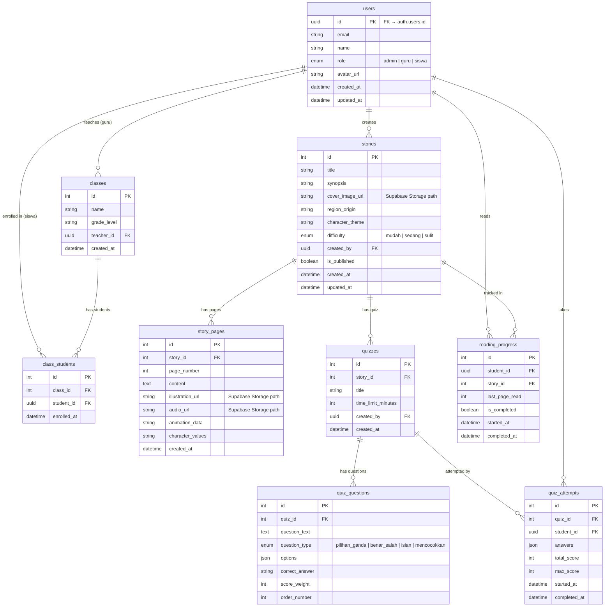

# PRD — Project Requirements Document
# Wayang Folkids (Folktale Literacy for Kids)

## 1. Overview
Aplikasi Wayang Folkids adalah platform digital interaktif berbasis web yang dirancang untuk mendukung penguatan literasi dan pembentukan karakter siswa Sekolah Dasar (SD) melalui konten cerita rakyat dan wayang digital. Masalah utama yang ingin diselesaikan adalah rendahnya minat baca dan literasi anak terhadap budaya lokal, serta keterbatasan media pembelajaran interaktif yang menghubungkan kearifan lokal dengan teknologi modern.

Tujuan utama aplikasi adalah menyediakan ekosistem pembelajaran digital yang memungkinkan:
- **Siswa** mengakses cerita rakyat dan wayang digital secara interaktif melalui teks, ilustrasi, audiovisual, dan animasi sederhana bermuatan nilai karakter.
- **Guru** memanfaatkan fitur asesmen berbasis game interaktif untuk mengukur pemahaman literasi siswa.
- **Guru/Admin** mengelola, mengunggah, dan memodifikasi konten cerita serta soal asesmen melalui sistem manajemen konten (CMS) yang bersifat terbuka dan partisipatif.

## 2. Requirements
Berikut adalah persyaratan tingkat tinggi untuk pengembangan sistem:
- **Aksesibilitas:** Aplikasi harus responsif dan dapat diakses secara online melalui Web Browser di desktop, tablet, maupun smartphone (tablet diutamakan untuk penggunaan siswa di kelas).
- **Pengguna:** Sistem mendukung tiga peran — **Admin** (pengelola sistem), **Guru** (pembuat konten & pengawas asesmen), dan **Siswa** (konsumen konten & peserta asesmen).
- **Konten Multimedia:** Mendukung upload dan penyajian teks, gambar ilustrasi, audio narasi, video, dan animasi sederhana.
- **Online-First:** Aplikasi didesain untuk diakses secara online dengan performa optimal melalui SSR/SSG dan edge network Vercel.
- **Bahasa:** Antarmuka utama dalam Bahasa Indonesia dengan kemungkinan konten cerita dalam bahasa daerah.
- **Keamanan Anak:** Tidak ada fitur sosial terbuka (komentar publik, chat). Lingkungan belajar terkontrol.

## 3. Core Features
Fitur-fitur kunci yang harus ada dalam versi pertama (MVP):

### 3.1 Portal Siswa
1.  **Perpustakaan Cerita Digital**
    - Katalog cerita rakyat & wayang yang dapat dijelajahi berdasarkan kategori (daerah asal, tema karakter, tingkat kesulitan).
    - Setiap cerita ditampilkan dengan ilustrasi, teks naratif, dan audio narasi.
    - Animasi sederhana pada elemen wayang untuk meningkatkan daya tarik visual.

2.  **Pembaca Cerita Interaktif (Story Reader)**
    - Tampilan baca layar penuh dengan navigasi halaman per halaman.
    - Dukungan audio narasi otomatis (text-to-speech atau rekaman manual) dengan highlight teks.
    - Panel nilai karakter: menampilkan nilai-nilai moral yang terkandung di setiap segmen cerita.

3.  **Game & Kuis Literasi**
    - Kuis pemahaman bacaan setelah menyelesaikan cerita (pilihan ganda, benar/salah, mencocokkan).
    - Skor dan feedback instan setelah mengerjakan kuis.
    - Leaderboard kelas (opsional) untuk meningkatkan motivasi.

### 3.2 Portal Guru
4.  **Dashboard Guru**
    - Ringkasan performa siswa: jumlah cerita dibaca, rata-rata skor kuis, siswa aktif/tidak aktif.
    - Grafik progres literasi per siswa dan per kelas.

5.  **Manajemen Konten Cerita (CMS)**
    - Form untuk membuat, mengedit, dan menghapus cerita.
    - Upload media: ilustrasi (gambar), audio narasi, dan video pendukung.
    - Editor teks dengan pemformatan dasar (heading, paragraf, bold, italic).
    - Penandaan (tagging): daerah asal, tema karakter, tingkat kesulitan.

6.  **Manajemen Asesmen**
    - Buat, edit, dan hapus soal kuis per cerita.
    - Tipe soal: pilihan ganda, benar/salah, isian singkat, dan mencocokkan.
    - Atur bobot skor dan batas waktu pengerjaan.
    - Lihat hasil asesmen per siswa dan per kelas.

### 3.3 Portal Admin
7.  **Manajemen Pengguna**
    - Tambah, edit, nonaktifkan akun Guru dan Siswa.
    - Atur kelas dan kelompok belajar.
    - Reset password pengguna via Supabase Auth.

8.  **Dashboard Admin**
    - Statistik keseluruhan: total pengguna, total cerita, total kuis dikerjakan.
    - Monitoring aktivitas sistem.

## 4. User Flow

### 4.1 Alur Siswa
1.  **Login:** Siswa masuk menggunakan username dan password melalui Supabase Auth.
2.  **Jelajah Cerita:** Siswa membuka Perpustakaan Cerita, memilih cerita berdasarkan minat atau arahan guru.
3.  **Baca & Dengarkan:** Siswa membaca cerita secara interaktif dengan dukungan audio dan animasi wayang.
4.  **Kerjakan Kuis:** Setelah menyelesaikan cerita, siswa mengerjakan kuis literasi terkait.
5.  **Lihat Hasil:** Siswa melihat skor dan feedback dari kuis yang dikerjakan.

### 4.2 Alur Guru
1.  **Login:** Guru masuk menggunakan email dan password melalui Supabase Auth.
2.  **Monitoring:** Guru melihat Dashboard untuk memantau progres literasi siswa.
3.  **Buat Konten:** Guru membuka menu CMS untuk membuat cerita baru lengkap dengan media dan tagging.
4.  **Buat Asesmen:** Guru menambahkan soal kuis yang terhubung dengan cerita.
5.  **Evaluasi:** Guru memeriksa hasil asesmen siswa dan memberikan tindak lanjut.

### 4.3 Alur Admin
1.  **Login:** Admin masuk menggunakan email dan password melalui Supabase Auth.
2.  **Kelola Pengguna:** Admin mendaftarkan akun guru dan siswa serta mengatur kelas.
3.  **Monitor Sistem:** Admin memantau statistik penggunaan dan aktivitas platform.

## 5. Architecture
Berikut adalah gambaran arsitektur sistem dan aliran data. Sistem menggunakan arsitektur fullstack monolitik dengan Next.js sebagai frontend sekaligus backend (API Routes), terintegrasi penuh dengan ekosistem Supabase untuk database, autentikasi, dan penyimpanan file.

```
┌─────────────────────────────────────────────────────────────────────┐
│                         DEPLOYMENT LAYER                           │
│                                                                     │
│                      ┌──────────────────────┐                       │
│                      │       Vercel          │                       │
│                      │   (Next.js Fullstack) │                       │
│                      │                       │                       │
│                      │  • SSR/SSG Pages      │                       │
│                      │  • API Routes         │                       │
│                      │  • Edge Network       │                       │
│                      │  • Auto-scaling       │                       │
│                      └──────────┬────────────┘                       │
│                                 │                                    │
└─────────────────────────────────┼────────────────────────────────────┘
                                  │ HTTPS
                                  │
┌─────────────────────────────────▼────────────────────────────────────┐
│                      SUPABASE CLOUD (BaaS)                          │
│                                                                     │
│  ┌──────────────────┐ ┌──────────────────┐ ┌─────────────────────┐  │
│  │  Supabase Auth   │ │    PostgreSQL     │ │  Supabase Storage   │  │
│  │                  │ │    Database       │ │                     │  │
│  │  • Email/Pass    │ │                   │ │  • Ilustrasi        │  │
│  │  • Magic Link    │ │  • Stories Data   │ │  • Audio Narasi     │  │
│  │  • Role (RBAC)   │ │  • Quiz Data      │ │  • Video            │  │
│  │  • JWT Tokens    │ │  • Progress Data  │ │  • Cover Images     │  │
│  │  • Row Level     │ │  • User Profiles  │ │  • CDN Built-in     │  │
│  │    Security      │ │  • Analytics      │ │  • Transformations  │  │
│  └──────────────────┘ └──────────────────┘ └─────────────────────┘  │
│                                                                     │
└─────────────────────────────────────────────────────────────────────┘
```



## 6. Database Schema

Berikut adalah Entity Relationship Diagram (ERD). Tabel `users` terhubung dengan `auth.users` milik Supabase Auth melalui kolom `id` (UUID). Supabase Auth menangani seluruh manajemen kredensial, sehingga tabel ini hanya menyimpan data profil tambahan.



| Tabel | Deskripsi |
|-------|-----------|
| **users** | Profil pengguna yang terhubung ke `auth.users` Supabase. Tidak menyimpan password (ditangani Supabase Auth) |
| **classes** | Data kelas yang dikelola oleh Guru |
| **class_students** | Relasi many-to-many antara kelas dan siswa |
| **stories** | Master data cerita rakyat/wayang dengan metadata kategori. URL media merujuk ke Supabase Storage paths |
| **story_pages** | Konten per halaman cerita: teks, ilustrasi, audio, animasi, dan nilai karakter |
| **quizzes** | Kuis yang terhubung ke cerita tertentu |
| **quiz_questions** | Bank soal per kuis dengan berbagai tipe |
| **quiz_attempts** | Rekam jejak pengerjaan kuis oleh siswa beserta skor |
| **reading_progress** | Tracking progres baca siswa per cerita |

## 7. Design & Technical Constraints

### 7.1 Tech Stack

| Layer | Teknologi | Alasan |
|-------|-----------|--------|
| **Frontend** | **Next.js 14+ (App Router)** dengan TypeScript | SSR/SSG untuk performa optimal dan SEO, React Server Components untuk mengurangi JS di client, streaming untuk UX responsif |
| **Styling** | **Tailwind CSS** + **Framer Motion** | Rapid UI development dengan utility-first CSS, animasi halus untuk elemen wayang interaktif |
| **Backend** | **Next.js API Routes** (Route Handlers) | Satu codebase fullstack, serverless-ready di Vercel, tidak perlu infrastruktur backend terpisah |
| **Database** | **Supabase (PostgreSQL)** | Cloud-hosted PostgreSQL dengan Row Level Security (RLS) untuk isolasi data per role, auto-generated REST API, Realtime subscriptions, dan free tier generous untuk MVP |
| **Authentication** | **Supabase Auth** | Email/password dan magic link bawaan, integrasi langsung dengan RLS untuk authorization di level database, mendukung RBAC native tanpa middleware tambahan |
| **File Storage** | **Supabase Storage** | Penyimpanan file terintegrasi penuh dengan auth dan RLS. CDN built-in untuk delivery media cepat. Image transformations on-the-fly (resize, crop) |
| **Deployment** | **Vercel** | Platform deployment paling optimal untuk Next.js — auto-scaling, preview deployments per branch, edge network global, dan analytics bawaan |

### 7.2 Struktur Project

```
wayang-folkids/
├── src/
│   ├── app/                          # Next.js App Router
│   │   ├── (auth)/                   # Route group: halaman login/register
│   │   │   ├── login/page.tsx
│   │   │   └── register/page.tsx
│   │   ├── (siswa)/                  # Route group: Portal Siswa
│   │   │   ├── perpustakaan/page.tsx
│   │   │   ├── cerita/[id]/page.tsx
│   │   │   └── kuis/[id]/page.tsx
│   │   ├── (guru)/                   # Route group: Portal Guru
│   │   │   ├── dashboard/page.tsx
│   │   │   ├── cms/
│   │   │   │   ├── page.tsx          # Daftar cerita
│   │   │   │   ├── buat/page.tsx     # Form buat cerita
│   │   │   │   └── [id]/edit/page.tsx
│   │   │   └── asesmen/page.tsx
│   │   ├── (admin)/                  # Route group: Portal Admin
│   │   │   ├── dashboard/page.tsx
│   │   │   └── pengguna/page.tsx
│   │   ├── api/                      # API Route Handlers
│   │   │   ├── stories/route.ts
│   │   │   ├── quizzes/route.ts
│   │   │   ├── progress/route.ts
│   │   │   └── upload/route.ts
│   │   ├── layout.tsx                # Root layout
│   │   └── page.tsx                  # Landing page
│   ├── components/                   # Reusable UI components
│   │   ├── ui/                       # Primitives (Button, Input, Card)
│   │   ├── story-reader/             # Story Reader components
│   │   ├── quiz/                     # Quiz components
│   │   └── dashboard/                # Dashboard widgets
│   ├── lib/                          # Utilities & config
│   │   ├── supabase/
│   │   │   ├── client.ts             # Browser Supabase client
│   │   │   ├── server.ts             # Server Supabase client
│   │   │   └── middleware.ts         # Auth middleware
│   │   └── utils.ts
│   ├── hooks/                        # Custom React hooks
│   └── types/                        # TypeScript type definitions
├── supabase/
│   ├── migrations/                   # SQL migration files
│   └── seed.sql                      # Seed data (cerita contoh)
├── public/                           # Static assets
├── next.config.ts
├── tailwind.config.ts
└── package.json
```

### 7.3 Supabase Row Level Security (RLS) Policies

Berikut adalah kebijakan RLS yang diterapkan di level database untuk mengontrol akses data berdasarkan role pengguna:

| Tabel | Policy | Deskripsi |
|-------|--------|-----------|
| **stories** | `SELECT` untuk semua user terautentikasi | Semua role bisa membaca cerita yang `is_published = true` |
| **stories** | `INSERT/UPDATE/DELETE` untuk guru & admin | Guru hanya bisa mengelola cerita miliknya sendiri (`created_by = auth.uid()`). Admin bisa mengelola semua cerita |
| **story_pages** | `SELECT` untuk semua user terautentikasi | Semua role bisa membaca halaman cerita yang story-nya published |
| **quiz_attempts** | `INSERT` untuk siswa | Siswa hanya bisa menyimpan attempt miliknya sendiri |
| **quiz_attempts** | `SELECT` untuk siswa, guru, admin | Siswa melihat miliknya sendiri. Guru melihat attempt siswa di kelasnya. Admin melihat semua |
| **reading_progress** | `INSERT/UPDATE` untuk siswa | Siswa hanya bisa mengelola progress miliknya sendiri |
| **users** | `SELECT` untuk admin | Hanya admin yang bisa melihat daftar semua pengguna |

### 7.4 Design Constraints

1.  **UI/UX untuk Anak:**
    - Desain harus colorful, playful, dan ramah anak dengan elemen visual wayang/batik sebagai identitas.
    - Navigasi sederhana dengan ikon besar dan label jelas.
    - Font berukuran besar dan mudah dibaca (minimum 16px body text).
    - Minimasi input teks untuk siswa — utamakan interaksi tap/klik.

2.  **Typography Rules:**
    - **Sans (Heading & UI):** `Nunito, 'Segoe UI', sans-serif` — rounded dan ramah anak.
    - **Serif (Story Reader):** `Literata, Georgia, serif` — optimal untuk readability konten panjang.
    - **Mono (Code/Data):** `JetBrains Mono, monospace` — untuk tampilan data di dashboard guru/admin.

3.  **Aksesibilitas:**
    - Kontras warna minimum WCAG AA (4.5:1 untuk teks normal).
    - Semua gambar memiliki alt text deskriptif.
    - Navigasi keyboard-friendly.
    - Audio narasi sebagai pelengkap teks, bukan pengganti.

4.  **Performa:**
    - Lazy loading untuk media (gambar, audio, video).
    - Image optimization otomatis via Next.js `<Image>` component + Supabase Storage transformations.
    - React Server Components untuk mengurangi bundle JS di client.
    - Target Lighthouse score > 80 di semua kategori.
    - Bundle size frontend < 500KB (initial load).

5.  **Keamanan:**
    - Supabase RLS untuk isolasi data antar role langsung di level database (zero-trust).
    - Supabase Auth middleware di Next.js untuk proteksi route dan API.
    - Input sanitization untuk semua form CMS.
    - Rate limiting pada API Route Handlers.
    - Supabase Storage policies untuk kontrol upload per role (guru & admin only).
    - Validasi file upload (tipe MIME, ukuran maksimal, dan konten).
    - CORS otomatis dikelola oleh Vercel.

## 8. Milestones

| Fase | Durasi | Deliverables |
|------|--------|-------------|
| **Fase 1 — Foundation** | 3 minggu | Setup Next.js project, integrasi Supabase (Auth + DB + Storage), database schema & migrations, RLS policies, CRUD users & classes |
| **Fase 2 — CMS & Konten** | 4 minggu | CMS cerita (CRUD + media upload ke Supabase Storage), Story Reader dasar, manajemen halaman cerita |
| **Fase 3 — Interaktif & Asesmen** | 3 minggu | Audio narasi, animasi wayang sederhana (Framer Motion), sistem kuis & scoring |
| **Fase 4 — Dashboard & Analytics** | 2 minggu | Dashboard Guru (progres siswa), Dashboard Admin (statistik sistem) |
| **Fase 5 — Polish & Launch** | 2 minggu | UI refinement, testing, bug fixes, deployment ke Vercel, custom domain setup, dan onboarding konten awal |
| **Total Estimasi** | **14 minggu** | MVP siap digunakan secara online untuk pilot program |

## 9. Success Metrics
Indikator keberhasilan MVP:

| Metrik | Target |
|--------|--------|
| Jumlah cerita aktif di platform | ≥ 15 cerita dalam 1 bulan pertama |
| Rata-rata cerita dibaca per siswa per minggu | ≥ 3 cerita |
| Completion rate kuis | ≥ 70% siswa menyelesaikan kuis setelah baca cerita |
| Rata-rata skor kuis | ≥ 60% dari skor maksimal |
| Guru aktif mengupload konten | ≥ 50% guru terdaftar upload minimal 1 cerita per bulan |
| Uptime sistem | ≥ 99% |